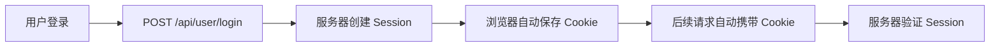

# 宠物领养平台 - 前端开发完整指南

## 📋 目录

- [概述](#概述)
- [技术栈与基础配置](#技术栈与基础配置)
- [认证机制](#认证机制)
- [用户模块](#用户模块)
- [宠物模块](#宠物模块)
- [领养模块](#领养模块)
- [评论模块](#评论模块)
- [文件上传](#文件上传)
- [管理员后台](#管理员后台)
- [完整示例项目](#完整示例项目)
- [常见问题](#常见问题)

---

## 概述

### 项目简介
这是一个线上宠物领养平台的后端 API 文档，提供完整的 RESTful 接口供前端调用。

### 基础信息
- **基础URL**: `http://localhost:8080`
- **API文档**: http://localhost:8080/swagger-ui.html
- **响应格式**: 统一 JSON 格式

### 统一响应格式
```json
{
  "code": 200,
  "msg": "操作成功",
  "data": {}
}
```

### 响应码说明
| 状态码 | 说明 | 处理方式 |
|--------|------|----------|
| 200 | 操作成功 | 正常处理数据 |
| 401 | 未登录或登录过期 | 跳转登录页 |
| 403 | 权限不足 | 提示无权限 |
| 500 | 操作失败 | 显示错误信息 |

---

## 技术栈与基础配置

### 推荐前端技术栈
- **框架**: Vue 3 / React
- **UI库**: Element Plus / Ant Design
- **HTTP客户端**: Axios
- **状态管理**: Pinia / Redux
- **路由**: Vue Router / React Router

### Axios 配置示例

```javascript
// src/utils/request.js
import axios from 'axios';
import { ElMessage } from 'element-plus';
import router from '@/router';

const request = axios.create({
  baseURL: 'http://localhost:8080',
  timeout: 10000,
  withCredentials: true  // 重要：允许携带 Cookie（Session）
});

// 请求拦截器
request.interceptors.request.use(
  config => {
    // 可以在这里添加 Token（如果使用 JWT）
    return config;
  },
  error => {
    return Promise.reject(error);
  }
);

// 响应拦截器
request.interceptors.response.use(
  response => {
    const res = response.data;
    
    // 统一处理业务错误
    if (res.code !== 200) {
      ElMessage.error(res.msg || '请求失败');
      
      // 401 未登录，跳转登录页
      if (res.code === 401) {
        router.push('/login');
      }
      
      return Promise.reject(new Error(res.msg));
    }
    
    return res;
  },
  error => {
    if (error.response) {
      switch (error.response.status) {
        case 401:
          ElMessage.error('请先登录');
          router.push('/login');
          break;
        case 403:
          ElMessage.error('无权限操作');
          break;
        default:
          ElMessage.error(error.response.data?.msg || '网络错误');
      }
    } else {
      ElMessage.error('网络连接失败');
    }
    return Promise.reject(error);
  }
);

export default request;
```

---

## 认证机制

### Session 认证流程



### 关键配置
```javascript
// Axios 必须配置 withCredentials
axios.create({
  withCredentials: true  // ← 重要！
});
```

### 检查登录状态
```javascript
// 方法1：调用接口检查
async function checkLogin() {
  try {
    const res = await request.get('/api/user/current');
    return res.data; // 返回用户信息
  } catch (error) {
    return null; // 未登录
  }
}

// 方法2：路由守卫
router.beforeEach((to, from, next) => {
  const requiresAuth = to.meta.requiresAuth;
  
  if (requiresAuth) {
    checkLogin().then(user => {
      if (user) {
        next();
      } else {
        next('/login');
      }
    });
  } else {
    next();
  }
});
```

---

## 用户模块

### 1. 用户注册

**接口**: `POST /api/user/register`

**请求参数**:
```javascript
{
  account: "user123",      // 必填，3-20位字符
  password: "password123", // 必填，至少6位
  nickname: "张三",        // 必填
  phone: "13800138000"     // 可选，中国大陆手机号
}
```

**使用示例**:
```vue
<template>
  <el-form :model="form" :rules="rules">
    <el-form-item label="账号" prop="account">
      <el-input v-model="form.account" />
    </el-form-item>
    <el-form-item label="密码" prop="password">
      <el-input v-model="form.password" type="password" />
    </el-form-item>
    <el-form-item label="昵称" prop="nickname">
      <el-input v-model="form.nickname" />
    </el-form-item>
    <el-form-item label="手机号" prop="phone">
      <el-input v-model="form.phone" />
    </el-form-item>
    <el-button type="primary" @click="register">注册</el-button>
  </el-form>
</template>

<script setup>
import { reactive } from 'vue';
import request from '@/utils/request';
import { ElMessage } from 'element-plus';

const form = reactive({
  account: '',
  password: '',
  nickname: '',
  phone: ''
});

const rules = {
  account: [
    { required: true, message: '请输入账号', trigger: 'blur' },
    { min: 3, max: 20, message: '长度在3到20个字符', trigger: 'blur' }
  ],
  password: [
    { required: true, message: '请输入密码', trigger: 'blur' },
    { min: 6, message: '密码至少6位', trigger: 'blur' }
  ],
  phone: [
    { pattern: /^1[3-9]\d{9}$/, message: '手机号格式不正确', trigger: 'blur' }
  ]
};

const register = async () => {
  try {
    const res = await request.post('/api/user/register', form);
    ElMessage.success('注册成功');
    // 跳转到登录页
  } catch (error) {
    // 错误已由拦截器处理
  }
};
</script>
```

---

### 2. 用户登录

**接口**: `POST /api/user/login`

**请求参数**:
```javascript
{
  account: "user123",  // 可以是账号或手机号
  password: "password123"
}
```

**使用示例**:
```vue
<template>
  <el-form :model="form">
    <el-form-item label="账号/手机号">
      <el-input v-model="form.account" />
    </el-form-item>
    <el-form-item label="密码">
      <el-input v-model="form.password" type="password" />
    </el-form-item>
    <el-button type="primary" @click="login">登录</el-button>
  </el-form>
</template>

<script setup>
import { reactive } from 'vue';
import request from '@/utils/request';
import { useRouter } from 'vue-router';
import { ElMessage } from 'element-plus';

const router = useRouter();
const form = reactive({
  account: '',
  password: ''
});

const login = async () => {
  try {
    const res = await request.post('/api/user/login', form);
    ElMessage.success('登录成功');
    router.push('/');
  } catch (error) {
    // 错误处理
  }
};
</script>
```

---

### 3. 获取当前用户信息

**接口**: `GET /api/user/current`

**认证**: 需要登录

**响应数据**:
```json
{
  "code": 200,
  "data": {
    "id": 1,
    "account": "user123",
    "nickname": "张三",
    "phone": "13800138000",
    "role": 0,  // 0:普通用户, 1:管理员
    "status": 0 // 0:正常, 1:禁用
  }
}
```

**使用示例**:
```javascript
// 在组件中获取用户信息
import { ref, onMounted } from 'vue';
import request from '@/utils/request';

const currentUser = ref(null);

onMounted(async () => {
  try {
    const res = await request.get('/api/user/current');
    currentUser.value = res.data;
  } catch (error) {
    currentUser.value = null;
  }
});
```

---

### 4. 退出登录

**接口**: `GET /api/user/logout`

**认证**: 需要登录

**使用示例**:
```javascript
const logout = async () => {
  try {
    await request.get('/api/user/logout');
    ElMessage.success('已退出登录');
    router.push('/login');
  } catch (error) {
    // 即使失败也跳转
    router.push('/login');
  }
};
```

---

## 宠物模块

### 1. 获取宠物列表（分页+筛选）

**接口**: `GET /api/pet/list`

**请求参数**:
| 参数 | 类型 | 必填 | 默认值 | 说明 |
|------|------|------|--------|------|
| species | string | ❌ | - | 物种（猫/狗/其他） |
| keyword | string | ❌ | - | 搜索关键词 |
| page | integer | ❌ | 1 | 页码 |
| size | integer | ❌ | 8 | 每页数量（最大50） |

**响应数据**:
```json
{
  "code": 200,
  "data": {
    "content": [
      {
        "id": 1,
        "name": "小白",
        "species": "猫",
        "breed": "英短",
        "age": 2,
        "image": "/uploads/images/2026/05/abc.jpg",
        "description": "性格温顺",
        "health": "健康",
        "status": "待领养",
        "addTime": "2026-05-20T10:30:00"
      }
    ],
    "totalElements": 20,
    "totalPages": 3,
    "number": 0,
    "size": 8
  }
}
```

**完整组件示例**:
```vue
<template>
  <div class="pet-list">
    <!-- 搜索栏 -->
    <el-form :inline="true" :model="searchForm">
      <el-form-item label="物种">
        <el-select v-model="searchForm.species" placeholder="全部">
          <el-option label="全部" value=""></el-option>
          <el-option label="猫" value="猫"></el-option>
          <el-option label="狗" value="狗"></el-option>
          <el-option label="其他" value="其他"></el-option>
        </el-select>
      </el-form-item>
      
      <el-form-item label="关键词">
        <el-input 
          v-model="searchForm.keyword" 
          placeholder="搜索名称/品种/描述"
          clearable
          @keyup.enter="loadPets">
        </el-input>
      </el-form-item>
      
      <el-form-item>
        <el-button type="primary" @click="loadPets">搜索</el-button>
        <el-button @click="resetSearch">重置</el-button>
      </el-form-item>
    </el-form>
    
    <!-- 宠物卡片 -->
    <el-row :gutter="20">
      <el-col :span="6" v-for="pet in pets" :key="pet.id">
        <el-card shadow="hover" class="pet-card">
          
          <h3>{{ pet.name }}</h3>
          <p>{{ pet.breed }} · {{ pet.age }}岁</p>
          <el-tag :type="getStatusType(pet.status)">
            {{ pet.status }}
          </el-tag>
          <el-button type="primary" @click="viewDetail(pet.id)">
            查看详情
          </el-button>
        </el-card>
      </el-col>
    </el-row>
    
    <!-- 分页 -->
    <el-pagination
      @current-change="handlePageChange"
      :current-page="pagination.page"
      :page-size="pagination.size"
      :total="pagination.total"
      layout="total, prev, pager, next">
    </el-pagination>
  </div>
</template>

<script setup>
import { ref, reactive, onMounted } from 'vue';
import { useRouter } from 'vue-router';
import request from '@/utils/request';

const router = useRouter();

const searchForm = reactive({
  species: '',
  keyword: ''
});

const pets = ref([]);
const pagination = reactive({
  page: 1,
  size: 8,
  total: 0
});

const loadPets = async () => {
  try {
    const res = await request.get('/api/pet/list', {
      params: {
        species: searchForm.species,
        keyword: searchForm.keyword,
        page: pagination.page,
        size: pagination.size
      }
    });
    
    pets.value = res.data.content;
    pagination.total = res.data.totalElements;
  } catch (error) {
    // 错误处理
  }
};

const handlePageChange = (page) => {
  pagination.page = page;
  loadPets();
};

const resetSearch = () => {
  searchForm.species = '';
  searchForm.keyword = '';
  pagination.page = 1;
  loadPets();
};

const getImageUrl = (imagePath) => {
  if (!imagePath) return '/default-pet.png';
  return imagePath.startsWith('http') 
    ? imagePath 
    : 'http://localhost:8080' + imagePath;
};

const getStatusType = (status) => {
  const map = {
    '待领养': 'success',
    '已领养': 'info',
    '下架': 'danger'
  };
  return map[status] || '';
};

const viewDetail = (id) => {
  router.push(`/pet/${id}`);
};

onMounted(() => {
  loadPets();
});
</script>

<style scoped>
.pet-card {
  margin-bottom: 20px;
}

.pet-image {
  width: 100%;
  height: 200px;
  object-fit: cover;
  border-radius: 8px;
}
</style>
```

---

### 2. 获取宠物详情

**接口**: `GET /api/pet/{id}`

**路径参数**: `id` - 宠物ID

**响应数据**:
```json
{
  "code": 200,
  "data": {
    "id": 1,
    "name": "小白",
    "species": "猫",
    "breed": "英短",
    "age": 2,
    "image": "/uploads/images/2026/05/abc.jpg",
    "description": "性格温顺，已驱虫，喜欢安静的环境...",
    "health": "健康",
    "status": "待领养",
    "addTime": "2026-05-20T10:30:00"
  }
}
```

**使用示例**:
```vue
<template>
  <div class="pet-detail" v-loading="loading">
    <el-row :gutter="20">
      <el-col :span="12">
        
      </el-col>
      
      <el-col :span="12">
        <h1>{{ pet.name }}</h1>
        <el-descriptions :column="2" border>
          <el-descriptions-item label="物种">{{ pet.species }}</el-descriptions-item>
          <el-descriptions-item label="品种">{{ pet.breed }}</el-descriptions-item>
          <el-descriptions-item label="年龄">{{ pet.age }}岁</el-descriptions-item>
          <el-descriptions-item label="健康状况">{{ pet.health }}</el-descriptions-item>
          <el-descriptions-item label="状态">
            <el-tag :type="getStatusType(pet.status)">
              {{ pet.status }}
            </el-tag>
          </el-descriptions-item>
        </el-descriptions>
        
        <div class="description-section">
          <h3>详细介绍</h3>
          <p>{{ pet.description }}</p>
        </div>
        
        <el-button 
          type="primary" 
          size="large"
          @click="applyAdoption"
          v-if="pet.status === '待领养' && isLoggedIn">
          申请领养
        </el-button>
      </el-col>
    </el-row>
  </div>
</template>

<script setup>
import { ref, onMounted } from 'vue';
import { useRoute, useRouter } from 'vue-router';
import request from '@/utils/request';

const route = useRoute();
const router = useRouter();

const pet = ref({});
const loading = ref(false);
const isLoggedIn = ref(false);

const loadPetDetail = async () => {
  loading.value = true;
  try {
    const res = await request.get(`/api/pet/${route.params.id}`);
    pet.value = res.data;
  } catch (error) {
    router.back();
  } finally {
    loading.value = false;
  }
};

const applyAdoption = () => {
  router.push(`/adoption/apply/${pet.value.id}`);
};

const getImageUrl = (imagePath) => {
  if (!imagePath) return '/default-pet.png';
  return imagePath.startsWith('http') 
    ? imagePath 
    : 'http://localhost:8080' + imagePath;
};

const getStatusType = (status) => {
  const map = {
    '待领养': 'success',
    '已领养': 'info',
    '下架': 'danger'
  };
  return map[status] || '';
};

onMounted(() => {
  loadPetDetail();
  // 检查登录状态
  request.get('/api/user/current')
    .then(() => { isLoggedIn.value = true; })
    .catch(() => { isLoggedIn.value = false; });
});
</script>
```

---

## 领养模块

### 1. 提交领养申请

**接口**: `POST /api/adoption/apply`

**认证**: 需要登录

**请求参数**:
```javascript
{
  petId: 1,                    // 必填，宠物ID
  reason: "我很喜欢这只宠物...", // 必填，至少10字符
  address: "北京市朝阳区xxx"    // 必填，居住地址
}
```

**使用示例**:
```vue
<template>
  <el-form :model="form" :rules="rules">
    <el-form-item label="申请理由" prop="reason">
      <el-input 
        v-model="form.reason" 
        type="textarea"
        :rows="4"
        placeholder="请详细说明您的领养理由..."
        maxlength="500"
        show-word-limit>
      </el-input>
    </el-form-item>
    
    <el-form-item label="居住地址" prop="address">
      <el-input v-model="form.address" />
    </el-form-item>
    
    <el-button type="primary" @click="submit">提交申请</el-button>
  </el-form>
</template>

<script setup>
import { reactive } from 'vue';
import { useRoute, useRouter } from 'vue-router';
import request from '@/utils/request';
import { ElMessage } from 'element-plus';

const route = useRoute();
const router = useRouter();

const form = reactive({
  petId: parseInt(route.params.petId),
  reason: '',
  address: ''
});

const rules = {
  reason: [
    { required: true, message: '请输入申请理由', trigger: 'blur' },
    { min: 10, message: '申请理由至少10个字符', trigger: 'blur' }
  ],
  address: [
    { required: true, message: '请输入居住地址', trigger: 'blur' }
  ]
};

const submit = async () => {
  try {
    const res = await request.post('/api/adoption/apply', form);
    ElMessage.success('申请已提交，请等待审核');
    router.push('/my-applications');
  } catch (error) {
    // 错误处理
  }
};
</script>
```

---

### 2. 我的申请列表（增强版）

**接口**: `GET /api/adoption/my`

**认证**: 需要登录

**请求参数**:
| 参数 | 类型 | 必填 | 默认值 | 说明 |
|------|------|------|--------|------|
| page | integer | ❌ | 1 | 页码 |
| size | integer | ❌ | 5 | 每页数量 |

**响应数据**（包含宠物信息）:
```json
{
  "code": 200,
  "data": {
    "content": [
      {
        "application": {
          "id": 1,
          "petId": 5,
          "userId": 3,
          "reason": "我很喜欢这只宠物...",
          "address": "北京市朝阳区xxx",
          "status": "待审核",
          "applyTime": "2026-06-01T10:30:00",
          "auditTime": null
        },
        "pet": {
          "id": 5,
          "name": "小白",
          "image": "/uploads/images/2026/05/abc.jpg",
          "species": "猫",
          "breed": "英短"
        }
      }
    ],
    "totalElements": 10,
    "totalPages": 2,
    "number": 0,
    "size": 5
  }
}
```

**完整组件示例**:
```vue
<template>
  <div class="my-applications">
    <h2>我的领养申请</h2>
    
    <el-empty v-if="applications.length === 0" description="暂无申请记录">
      <el-button type="primary" @click="$router.push('/pets')">
        去浏览宠物
      </el-button>
    </el-empty>
    
    <el-card 
      v-for="item in applications" 
      :key="item.application.id"
      class="application-card">
      
      <div class="application-content">
        <!-- 宠物信息 -->
        <div class="pet-section">
          <el-image 
            :src="getPetImage(item.pet)" 
            fit="cover"
            class="pet-image">
          </el-image>
          
          <div class="pet-info">
            <h3>{{ item.pet.name }}</h3>
            <p>{{ item.pet.species }} · {{ item.pet.breed }}</p>
          </div>
        </div>
        
        <!-- 申请信息 -->
        <el-descriptions :column="2" border>
          <el-descriptions-item label="申请状态">
            <el-tag :type="getStatusType(item.application.status)">
              {{ item.application.status }}
            </el-tag>
          </el-descriptions-item>
          
          <el-descriptions-item label="申请时间">
            {{ formatDate(item.application.applyTime) }}
          </el-descriptions-item>
          
          <el-descriptions-item label="居住地址" :span="2">
            {{ item.application.address }}
          </el-descriptions-item>
          
          <el-descriptions-item label="申请理由" :span="2">
            {{ item.application.reason }}
          </el-descriptions-item>
        </el-descriptions>
        
        <!-- 操作按钮 -->
        <div class="action-section">
          <el-button size="small" @click="viewDetail(item.application.id)">
            查看详情
          </el-button>
          
          <el-button 
            v-if="item.application.status === '待审核'"
            size="small"
            type="warning"
            @click="cancelApplication(item.application.id)">
            撤回申请
          </el-button>
        </div>
      </div>
    </el-card>
    
    <el-pagination
      v-if="total > 0"
      @current-change="loadApplications"
      :current-page="currentPage"
      :page-size="pageSize"
      :total="total"
      layout="total, prev, pager, next">
    </el-pagination>
  </div>
</template>

<script setup>
import { ref, onMounted } from 'vue';
import { useRouter } from 'vue-router';
import request from '@/utils/request';
import { ElMessage, ElMessageBox } from 'element-plus';

const router = useRouter();

const applications = ref([]);
const currentPage = ref(1);
const pageSize = ref(5);
const total = ref(0);

const loadApplications = async (page = 1) => {
  currentPage.value = page;
  try {
    const res = await request.get('/api/adoption/my', {
      params: {
        page: currentPage.value,
        size: pageSize.value
      }
    });
    
    applications.value = res.data.content || [];
    total.value = res.data.totalElements || 0;
  } catch (error) {
    // 错误处理
  }
};

const getPetImage = (pet) => {
  if (!pet || !pet.image) return '/default-pet.png';
  return pet.image.startsWith('http') 
    ? pet.image 
    : 'http://localhost:8080' + pet.image;
};

const getStatusType = (status) => {
  const map = {
    '待审核': 'warning',
    '通过': 'success',
    '驳回': 'danger',
    '已撤回': 'info'
  };
  return map[status] || '';
};

const formatDate = (dateStr) => {
  if (!dateStr) return '-';
  return new Date(dateStr).toLocaleString('zh-CN');
};

const viewDetail = (appId) => {
  router.push(`/adoption/detail/${appId}`);
};

const cancelApplication = async (appId) => {
  try {
    await ElMessageBox.confirm('确定要撤回该申请吗？', '提示', {
      type: 'warning'
    });
    
    const res = await request.post(`/api/adoption/cancel/${appId}`);
    ElMessage.success('申请已撤回');
    loadApplications();
  } catch (error) {
    if (error !== 'cancel') {
      ElMessage.error(error.message);
    }
  }
};

onMounted(() => {
  loadApplications();
});
</script>
```

---

### 3. 撤回申请

**接口**: `POST /api/adoption/cancel/{appId}`

**认证**: 需要登录

**路径参数**: `appId` - 申请ID

**限制**: 只能撤回"待审核"状态的申请

**使用示例**:
```javascript
const cancelApplication = async (appId) => {
  try {
    await ElMessageBox.confirm('确定要撤回该申请吗？', '提示', {
      type: 'warning'
    });
    
    const res = await request.post(`/api/adoption/cancel/${appId}`);
    ElMessage.success('申请已撤回');
    // 刷新列表
  } catch (error) {
    if (error !== 'cancel') {
      ElMessage.error(error.message);
    }
  }
};
```

---

## 评论模块

### 1. 添加评论

**接口**: `POST /api/comment/add`

**认证**: 需要登录

**请求参数**:
```javascript
{
  petId: 1,
  content: "这只宠物真可爱！"  // 必填，最多500字符
}
```

**使用示例**:
```vue
<template>
  <div class="comment-form">
    <el-input
      v-model="content"
      type="textarea"
      :rows="3"
      placeholder="请输入评论内容（最多500字）"
      maxlength="500"
      show-word-limit>
    </el-input>
    <el-button type="primary" @click="submitComment">提交评论</el-button>
  </div>
</template>

<script setup>
import { ref } from 'vue';
import request from '@/utils/request';
import { ElMessage } from 'element-plus';

const props = defineProps(['petId']);
const emit = defineEmits(['refresh']);

const content = ref('');

const submitComment = async () => {
  if (!content.value.trim()) {
    ElMessage.warning('请输入评论内容');
    return;
  }
  
  try {
    const res = await request.post('/api/comment/add', {
      petId: props.petId,
      content: content.value
    });
    
    ElMessage.success('评论成功');
    content.value = '';
    emit('refresh'); // 通知父组件刷新列表
  } catch (error) {
    // 错误处理
  }
};
</script>
```

---

### 2. 获取评论列表（分页+用户昵称）

**接口**: `GET /api/comment/list/{petId}`

**路径参数**: `petId` - 宠物ID

**请求参数**:
| 参数 | 类型 | 必填 | 默认值 | 说明 |
|------|------|------|--------|------|
| page | integer | ❌ | 1 | 页码 |
| size | integer | ❌ | 10 | 每页数量 |

**响应数据**（包含用户昵称）:
```json
{
  "code": 200,
  "data": {
    "content": [
      {
        "comment": {
          "id": 1,
          "petId": 5,
          "userId": 3,
          "content": "这只宠物真可爱！",
          "createTime": "2026-06-01T10:30:00"
        },
        "nickname": "爱宠人士"
      }
    ],
    "totalElements": 20,
    "totalPages": 2,
    "number": 0,
    "size": 10
  }
}
```

**完整组件示例**:
```vue
<template>
  <div class="comments-section">
    <h3>评论列表</h3>
    
    <!-- 评论列表 -->
    <div v-for="item in comments" :key="item.comment.id" class="comment-item">
      <div class="comment-header">
        <span class="nickname">{{ item.nickname }}</span>
        <span class="time">{{ formatDate(item.comment.createTime) }}</span>
      </div>
      <p class="comment-content">{{ item.comment.content }}</p>
      
      <!-- 删除按钮（仅作者或管理员可见） -->
      <el-button 
        v-if="canDelete(item.comment)"
        size="mini" 
        type="danger"
        @click="deleteComment(item.comment.id)">
        删除
      </el-button>
    </div>
    
    <!-- 分页 -->
    <el-pagination
      @current-change="loadComments"
      :current-page="currentPage"
      :page-size="pageSize"
      :total="total"
      layout="total, prev, pager, next">
    </el-pagination>
    
    <!-- 添加评论 -->
    <CommentForm :petId="petId" @refresh="loadComments" />
  </div>
</template>

<script setup>
import { ref, onMounted } from 'vue';
import request from '@/utils/request';
import { ElMessage, ElMessageBox } from 'element-plus';
import CommentForm from './CommentForm.vue';

const props = defineProps(['petId']);

const comments = ref([]);
const currentPage = ref(1);
const pageSize = ref(10);
const total = ref(0);
const currentUser = ref(null);

const loadComments = async (page = 1) => {
  currentPage.value = page;
  try {
    const res = await request.get(`/api/comment/list/${props.petId}`, {
      params: {
        page: currentPage.value,
        size: pageSize.value
      }
    });
    
    comments.value = res.data.content;
    total.value = res.data.totalElements;
  } catch (error) {
    // 错误处理
  }
};

const canDelete = (comment) => {
  // 只有评论作者或管理员可以删除
  return currentUser.value && 
         (comment.userId === currentUser.value.id || 
          currentUser.value.role === 1);
};

const deleteComment = async (commentId) => {
  try {
    await ElMessageBox.confirm('确定要删除该评论吗？', '提示', {
      type: 'warning'
    });
    
    const res = await request.delete(`/api/comment/${commentId}`);
    ElMessage.success('删除成功');
    loadComments();
  } catch (error) {
    if (error !== 'cancel') {
      ElMessage.error(error.message);
    }
  }
};

const formatDate = (dateStr) => {
  if (!dateStr) return '-';
  return new Date(dateStr).toLocaleString('zh-CN');
};

onMounted(() => {
  loadComments();
  // 获取当前用户信息
  request.get('/api/user/current')
    .then(res => { currentUser.value = res.data; })
    .catch(() => { currentUser.value = null; });
});
</script>

<style scoped>
.comment-item {
  padding: 15px;
  border-bottom: 1px solid #eee;
}

.comment-header {
  display: flex;
  justify-content: space-between;
  margin-bottom: 10px;
}

.nickname {
  font-weight: bold;
  color: #333;
}

.time {
  color: #999;
  font-size: 12px;
}

.comment-content {
  margin: 10px 0;
  line-height: 1.6;
}
</style>
```

---

### 3. 删除评论

**接口**: `DELETE /api/comment/{commentId}`

**认证**: 需要登录

**权限**: 只能删除自己的评论，管理员可以删除任意评论

**使用示例**:
```javascript
const deleteComment = async (commentId) => {
  try {
    await ElMessageBox.confirm('确定要删除该评论吗？', '提示', {
      type: 'warning'
    });
    
    const res = await request.delete(`/api/comment/${commentId}`);
    ElMessage.success('删除成功');
    // 刷新列表
  } catch (error) {
    if (error !== 'cancel') {
      ElMessage.error(error.message);
    }
  }
};
```

---

## 文件上传

### 1. 单图上传

**接口**: `POST /api/upload/pet-image`

**认证**: 需要登录

**Content-Type**: `multipart/form-data`

**文件限制**:
- 格式: JPG、PNG、GIF、WEBP
- 大小: 最大 5MB

**使用示例**:
```vue
<template>
  <el-upload
    action="/api/upload/pet-image"
    :on-success="handleUploadSuccess"
    :before-upload="beforeUpload"
    list-type="picture-card">
    <i class="el-icon-plus"></i>
  </el-upload>
</template>

<script setup>
import { ElMessage } from 'element-plus';

const beforeUpload = (file) => {
  const isImage = file.type.startsWith('image/');
  const isLt5M = file.size / 1024 / 1024 < 5;
  
  if (!isImage) {
    ElMessage.error('只能上传图片文件！');
    return false;
  }
  if (!isLt5M) {
    ElMessage.error('图片大小不能超过5MB！');
    return false;
  }
  return true;
};

const handleUploadSuccess = (response) => {
  if (response.code === 200) {
    const imageUrl = response.data; // "/uploads/images/2026/05/xxx.jpg"
    ElMessage.success('上传成功');
    // 使用 imageUrl
  } else {
    ElMessage.error(response.msg);
  }
};
</script>
```

---

### 2. 批量上传

**接口**: `POST /api/upload/pet-images`

**认证**: 需要登录

**限制**: 最多10张图片

**使用示例**:
```javascript
const uploadMultipleImages = async (files) => {
  const formData = new FormData();
  for (let i = 0; i < files.length; i++) {
    formData.append('files', files[i]);
  }
  
  try {
    const res = await request.post('/api/upload/pet-images', formData, {
      headers: {
        'Content-Type': 'multipart/form-data'
      }
    });
    
    const imageUrls = res.data; // ["/uploads/.../1.jpg", ...]
    ElMessage.success('批量上传成功');
    return imageUrls;
  } catch (error) {
    ElMessage.error(error.message);
  }
};
```

---

## 管理员后台

### 管理员接口总览

所有管理员接口都需要：
1. ✅ 登录
2. ✅ 管理员权限（role=1）
3. ✅ 通过 AdminInterceptor 验证

### 1. 宠物管理

#### 添加宠物
```javascript
// 先上传图片
const formData = new FormData();
formData.append('file', selectedFile);

const uploadRes = await request.post('/api/upload/pet-image', formData);
const imageUrl = uploadRes.data;

// 再添加宠物
await request.post('/api/admin/pet/add', {
  name: '小花',
  species: '猫',
  breed: '布偶猫',
  age: 2,
  image: imageUrl,
  description: '性格温顺',
  health: '健康',
  status: '待领养'
});
```

#### 修改宠物状态
```javascript
// 标记为已领养
await request.put(`/api/admin/pet/${petId}/status?status=已领养`);

// 下架
await request.put(`/api/admin/pet/${petId}/status?status=下架`);
```

---

### 2. 领养申请审核

#### 审核申请
```javascript
// 通过
await request.put(`/api/admin/adoption/${appId}`, {
  status: '通过'
});

// 驳回
await request.put(`/api/admin/adoption/${appId}`, {
  status: '驳回'
});
```

---

### 3. 用户管理

#### 获取用户列表
```javascript
const res = await request.get('/api/admin/users');
const users = res.data;
```

#### 修改用户状态
```javascript
// 禁用用户
await request.put(`/api/admin/user/${userId}/status?status=1`);

// 启用用户
await request.put(`/api/admin/user/${userId}/status?status=0`);
```

---

## 完整示例项目

### 项目结构建议

```
src/
├── api/                  # API 接口封装
│   ├── user.js
│   ├── pet.js
│   ├── adoption.js
│   ├── comment.js
│   └── upload.js
├── components/           # 公共组件
│   ├── PetCard.vue
│   ├── CommentList.vue
│   └── ImageUploader.vue
├── views/                # 页面组件
│   ├── Home.vue
│   ├── Login.vue
│   ├── Register.vue
│   ├── PetList.vue
│   ├── PetDetail.vue
│   ├── MyApplications.vue
│   └── admin/
│       ├── Dashboard.vue
│       ├── PetManage.vue
│       ├── AdoptionAudit.vue
│       └── UserManage.vue
├── router/               # 路由配置
│   └── index.js
├── store/                # 状态管理
│   └── user.js
├── utils/                # 工具函数
│   └── request.js
└── App.vue
```

### API 封装示例

```javascript
// src/api/pet.js
import request from '@/utils/request';

export function getPetList(params) {
  return request.get('/api/pet/list', { params });
}

export function getPetDetail(id) {
  return request.get(`/api/pet/${id}`);
}

// src/api/adoption.js
export function applyAdoption(data) {
  return request.post('/api/adoption/apply', data);
}

export function getMyApplications(params) {
  return request.get('/api/adoption/my', { params });
}

export function cancelApplication(appId) {
  return request.post(`/api/adoption/cancel/${appId}`);
}
```

---

## 常见问题

### Q1: 跨域问题怎么办？

**A**: 确保 Axios 配置了 `withCredentials: true`，并且后端已配置 CORS。

### Q2: 图片显示不出来？

**A**: 检查图片路径是否正确，应该是 `/uploads/images/...` 格式，拼接完整 URL：
```javascript
const imageUrl = 'http://localhost:8080' + pet.image;
```

### Q3: 如何判断用户是否登录？

**A**: 调用 `/api/user/current` 接口，如果返回 401 则未登录。

### Q4: 分页数据不对？

**A**: 注意后端返回的页码从 0 开始，前端通常从 1 开始：
```javascript
const displayPage = response.data.number + 1;
```

### Q5: Session 丢失怎么办？

**A**: 确保：
1. Axios 配置了 `withCredentials: true`
2. 前后端域名和端口一致（或使用代理）
3. 浏览器没有禁用 Cookie

---

## 快速开始 checklist

- [ ] 配置 Axios（withCredentials: true）
- [ ] 实现登录/注册页面
- [ ] 实现路由守卫（检查登录状态）
- [ ] 实现宠物列表页（分页+筛选）
- [ ] 实现宠物详情页
- [ ] 实现领养申请功能
- [ ] 实现我的申请列表
- [ ] 实现评论功能
- [ ] 实现图片上传
- [ ] （可选）实现管理员后台

---

**文档版本**: v1.0  
**最后更新**: 2026-06-01  
**维护者**: 后端开发团队

**Swagger 在线文档**: http://localhost:8080/swagger-ui.html
